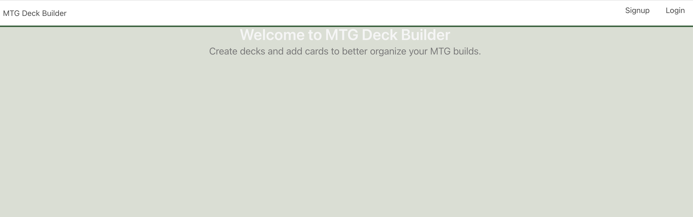
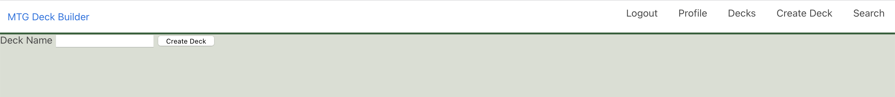
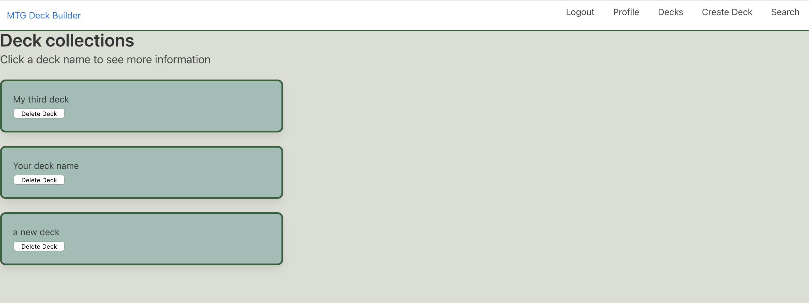
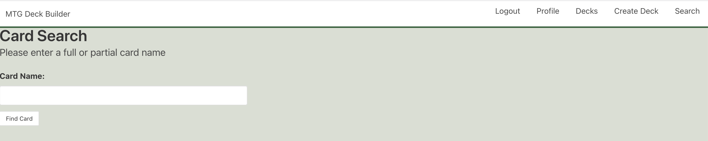
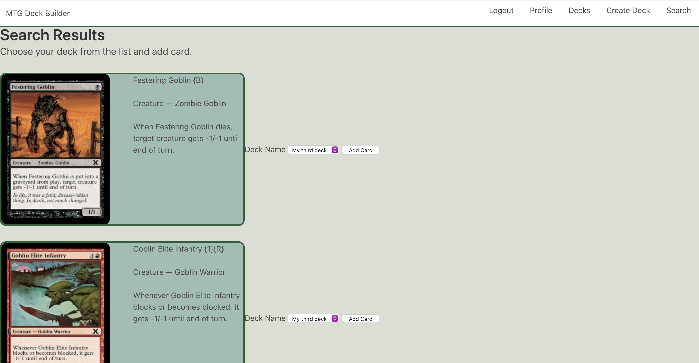

# MTG Deck Builder

MTG Deck Builder was created to be an easy way for you to organize deck ideas.

## Major Packages Used

- postGres: database
- Node.js: JS runtime
- express: web framework
- sequelize: Node.js ORM
- mtgsdk: SDK for MTG API
- passport: authentication management
- bulma: style
    
## Deployment Method

Deploy to Heroku with a postgresql backend. More details to follow

## Usage

You can access the site [here](https://mtgdeck-generator.herokuapp.com/)

### Welcome Screen
Just login to access your decks or search for new cards.



### Create a deck
Click the "Create Deck" link to create a new deck.



### Decks
Click the "Decks" link to view all of your decks.



### Search
Click on the "Search" link to search for a card by full or partial name.



### Search Results
Choose your deck from the dropdown and add your card



## Code Samples
### Models

- user
- deck
- card
- deckscards

### Code

```js
// Delete a single card from a deck. 
router.delete('/card/:deckId/:cardId', isLoggedIn, async (req, res) => {
  try {
  // params passed in from view decks/display
  const { deckId, cardId } = req.params
  // grab deck from model on deckId
  const deck = await db.deck.findOne({ where: { id:deckId }})
  // grab card from model on cardId
  const card = await db.card.findOne({ where: { id:cardId }})
  // use the association helper REMOVE to, well, remove the association from deck to the card instance 
  await deck.removeCard(card)
  // redirect(we don't want their URL on /card/:deckId/:cardId) to show cards in deck.
  res.redirect(`/decks/${deckId}`)
  }
  catch{
    req.flash('error', 'Sorry but please try to remove your card again.')
    res.redirect(`/decks/${deckId}`)
  }
})
```
```js
// Insert card into database and connect to a deck
router.post('/add', isLoggedIn, async (req, res) => {
    try {
    // Get the id of the Deck and Card
    const { idDeck, id } = req.body;
    // Select deck where id is the deck id
    const deck = await db.deck.findOne({ where: { id:idDeck } });
    // Select card by card id
    const card = await mtg.card.find(id);
    // Inserting data for card
    const [addedCard] = await db.card.findOrCreate({
        where: { name:card.card.name,
            manaCost:card.card.manaCost,
            cmc: card.card.cmc,
            colors: card.card.colors,
            colorIdentity: card.card.colorIdentity,
            type: card.card.type,
            types: card.card.types,
            rarity: card.card.rarity,
            set:card.card.set,
            setName: card.card.setName,
            text: card.card.text,
            artist: card.card.artist,
            number: card.card.number,
            layout: card.card.layout,
            imgUrl:card.card.imageUrl,
            printings: card.card.printings
        }
    })
    // Add the card to the deck by association
    await deck.addCard(addedCard)
    // Takes you back to the search page
    res.redirect('/search')} 
    catch (error) {
        req.flash('error', 'Sorry but please try to add your card again.')
        res.redirect('/search')
    }
})
```
## Biggest Struggles

- removing a card from a many-to-many association(deck-deakscards-card)
- updating a model 

## Biggest Snuggles

- James Brolin McGruff III (the dog that lives in my house)

## Future Considerations

- streamlined navigation
- ability to pick a cover for deck
- ability to add rule limitations to deck

## Contributing
Pull requests are welcome. For major changes, please open an issue first to discuss what you would like to change.

Please make sure to update tests as appropriate.

## License
[MIT](https://choosealicense.com/licenses/mit/)